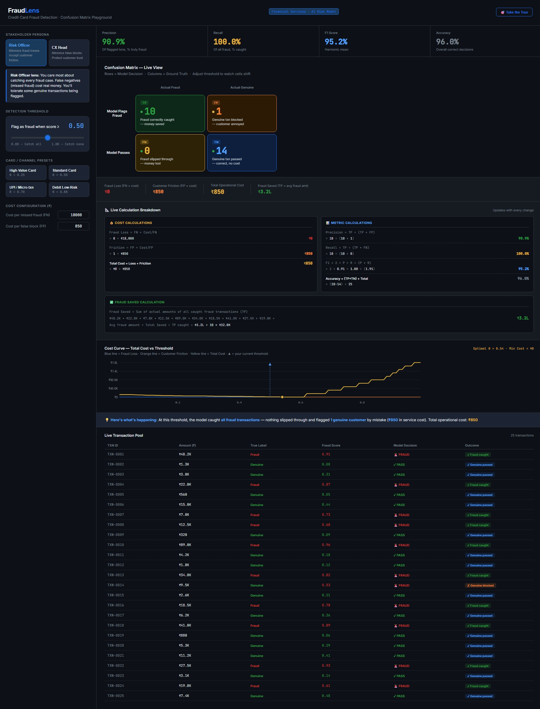
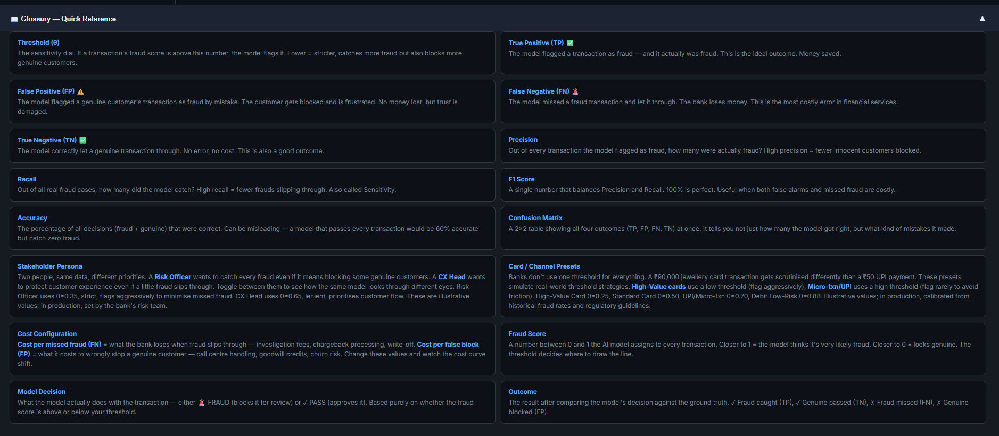

# FraudLens — Credit Card Fraud Detection Playground

A fully interactive confusion matrix playground built for the Financial Services domain. Designed to make AI model evaluation concepts accessible to both technical and non-technical audiences.

---

## 📸 Screenshots

### Full Tool View


### Glossary — Quick Reference


---

## 🔗 Live Demo

[FraudLens — Live on GitHub Pages](https://rishendra125.github.io/fraudLens_confusion_matrix_project/)

---

## 🎯 Purpose

FraudLens simulates how a bank's AI fraud detection model works. It lets you adjust a detection threshold and see in real time how that single decision affects fraud outcomes, customer experience, and business cost — all visualised through a live confusion matrix.

Built as a portfolio tool to demonstrate understanding of:
- AI model evaluation metrics
- Business cost tradeoffs in financial services
- Stakeholder-driven decision making
- Precision vs Recall tradeoffs

---

## 🔧 Features

### 1. Live Confusion Matrix
- Four cells: True Positive (TP), False Positive (FP), False Negative (FN), True Negative (TN)
- Updates in real time as you move the threshold slider
- Traffic light dots on each cell — green = good, amber = moderate, red = concerning
- Plain-English description inside each cell

### 2. Threshold Slider
- Drag from 0.01 to 0.99
- Controls when a transaction is flagged as fraud
- Lower = stricter (catches more fraud, blocks more genuine customers)
- Higher = lenient (fewer blocks, more fraud slips through)

### 3. Stakeholder Persona Toggle
- **Risk Officer** — auto-sets θ=0.35, prioritises catching all fraud
- **CX Head** — auto-sets θ=0.65, prioritises protecting customer experience
- Shows how the same model looks through different business lenses

### 4. Card / Channel Presets
- High-Value Card (θ=0.25)
- Standard Card (θ=0.50)
- UPI / Micro-txn (θ=0.70)
- Debit Low-Risk (θ=0.88)
- Simulates real-world threshold strategies by card type

### 5. Cost Configuration
- Configurable cost per missed fraud (FN) in ₹
- Configurable cost per false block (FP) in ₹
- Inputs are hardened — no negative values, no NaN

### 6. Cost Summary Panel
- Fraud Loss = FN × Cost per FN
- Customer Friction = FP × Cost per FP
- Total Operational Cost = Fraud Loss + Friction
- Fraud Saved = Sum of actual amounts of all caught fraud transactions

### 7. Plain Language Summary Bar
- Auto-generates a human-readable sentence explaining what's happening at the current threshold
- Updates live with every slider change

### 8. Live Calculation Breakdown
- Step-by-step math for all cost and metric calculations
- **Cost Calculations:** Fraud Loss, Customer Friction, Total Cost with values substituted
- **Metric Calculations:** Precision, Recall, F1, Accuracy with actual numbers plugged in
- **Fraud Saved Calculation:** Individual transaction amounts listed and summed

### 9. Cost Curve Chart
- Plots Fraud Loss (blue), Customer Friction (orange), and Total Cost (yellow) across all thresholds (0.01 to 0.99)
- Yellow dot marks the optimal threshold (lowest total cost)
- Blue dashed line with triangle tracks your current threshold position in real time
- Optimal threshold and minimum cost shown as a live badge

### 10. Live Transaction Pool
- 25 synthetic transactions with TXN ID, Amount, True Label, Fraud Score, Model Decision, Outcome
- Each row updates live as threshold changes
- Outcome badges: Fraud caught (TP), Genuine passed (TN), Fraud missed (FN), Genuine blocked (FP)

### 11. Guided Tour
- 4-step walkthrough triggered by "🎯 Take the Tour" button in the header
- Walks through: Welcome → Low Threshold → Sweet Spot → High Threshold
- Auto-sets threshold at each step with a plain-language explanation

### 12. Glossary — Quick Reference
16 terms covering all concepts used in the tool. Collapsible, starts closed.

| Term | Definition |
|---|---|
| Threshold (θ) | The sensitivity dial. If a transaction's fraud score is above this number, the model flags it. Lower = stricter. |
| True Positive (TP) | Fraud correctly caught — ideal outcome, money saved. |
| False Positive (FP) | Genuine customer blocked by mistake — no money lost but trust is damaged. |
| False Negative (FN) | Fraud missed and let through — the bank loses money, most costly error. |
| True Negative (TN) | Genuine transaction correctly passed — no error, no cost. |
| Precision | Of all flagged transactions, how many were actually fraud? High precision = fewer innocent customers blocked. |
| Recall | Of all real fraud cases, how many did the model catch? High recall = fewer frauds slipping through. |
| F1 Score | Balances Precision and Recall. 100% is perfect. |
| Accuracy | % of all decisions that were correct. Can be misleading on imbalanced datasets. |
| Confusion Matrix | 2×2 table showing all four outcomes at once. |
| Stakeholder Persona | Risk Officer (θ=0.35, strict) vs CX Head (θ=0.65, lenient). Illustrative values. |
| Card / Channel Presets | High-Value θ=0.25, Standard θ=0.50, UPI θ=0.70, Debit θ=0.88. Illustrative values. |
| Cost Configuration | FN cost = fraud loss (chargeback, write-off). FP cost = customer friction (call centre, churn). |
| Fraud Score | 0 to 1 score assigned by the model. Above threshold = flagged as fraud. |
| Model Decision | FRAUD (blocked) or PASS (approved) based on fraud score vs threshold. |
| Outcome | Result after comparing model decision against ground truth: TP, FP, FN, or TN. |

---

## 📊 Dataset

25 synthetic transactions across categories: Electronics, Grocery, Fuel, Jewellery, Food & Dining, Travel, Apparel, Pharmacy, Transfer.

- 10 fraudulent transactions
- 15 genuine transactions
- Fraud scores manually calibrated to create realistic separation with an overlap zone around 0.6–0.7

---

## 🏗️ Tech Stack

- Pure HTML, CSS, JavaScript — no frameworks, no dependencies
- Canvas API for the cost curve chart
- Google Fonts: Inter + JetBrains Mono
- Fully self-contained single file

---

## 📱 Responsive Design

- Desktop: two-column layout (left panel + right panel)
- Tablet (≤900px): single column, stacked layout
- Mobile (≤600px): matrix reflows to 2×2, metrics to 2-col, cost panel stacks vertically

---

## 👤 Author

**Rishendra Vikram Singh**
Senior Consultant | PMO & AI Orchestration
[LinkedIn](https://linkedin.com/in/rishendra-vikram-singh-a7355718a/) · [Portfolio](https://rishendra125.github.io)

---

## ⚠️ Disclaimer

All transaction data is synthetic and for illustrative purposes only. Threshold values are calibrated to reflect common industry logic and do not represent any real bank's production model.

---

## 📁 File Directory

```
FraudLens/
├── index.html                        # Main tool — fully self-contained, single file
├── FraudLens_README.md               # Project documentation (this file)
└── screenshots/
    ├── fraudlens-tool-overview.jpeg  # Screenshot — full tool view
    └── fraudlens-glossary.png        # Screenshot — glossary quick reference
```
